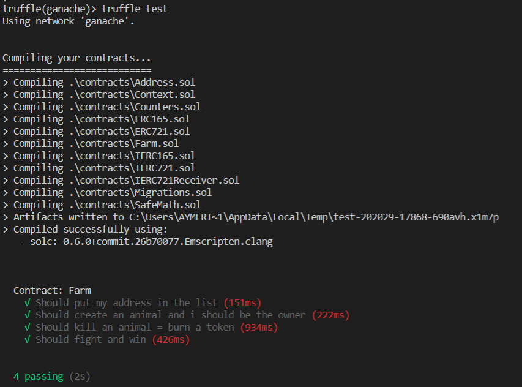

# My first ERC721 Token
## NTF : Non Fungible Token

- The ERC721 token was created with the files of OpenZeppelin.

- All of the ERC721 functions have been implemented.

- To migrate my contracts to GANACHE I set the port, the url and the network_id of ganache and I set the version of solidity on 0.6.0 in *truffle-config*.

- The contract is a farm, that means that we can have animals, we can sell them, we can exchange them, we can fight for them, we can have babies, etc...

- Only the owner of the contract can add new breeder to the list of breeders. I had one of my teacher Henri Lieutaud at this address : "0x6F891Cc103F5F320C129Baeb6622f52E15522527".

- To buy animal from someone else, there is an auction where every user can Bid. The one who send the most ETH win the animal. The buyer take the ETH, all of the looser take back their ETH.

- To deploy to Rinkenby Testnet, I have downloaded the *truffle HD wallet* package from npm, then I have created an account on infura to have an API KEY to connect truffle to my HD wallet on metamask. And then from the console I deploy my contracts using "truffle console --network rinkeby" and then "truffle deploy". I interacted with my contract from this console with "let ico = await ICO.deployed()" etc... or from *metamask* and *Mycrypto.com* with the ABI's.

- I run several tests with the command *truffle test* with node 11 because node 12/13 wasn't compatible : 

**Contract Address (ICO) : 0x7A968598be40b78B4e86bc4752458F92AEF5a3c1**

**You can access the ABI on the directory build\contracts**